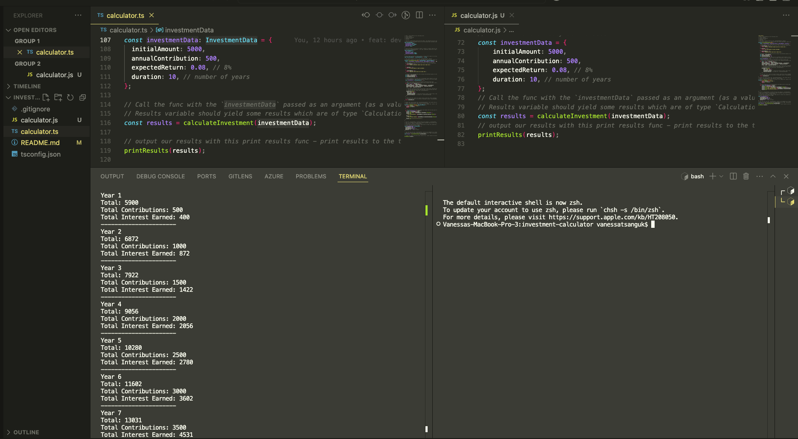

# Investment Calculator Application

I developed this simple and basic investment calculator application to showcase my technical skills in using **_TypeScript's most important essential features_** such as basic built-in types, object & array types, function types and custom types.

I see this project as a TypeScript demo project where I can demonstrate how I can work with basic types and compile my TypeScript code file in to vanilla JavaScript code file in order to run my application locally and test in the terminal and decide if my application works as expect - without any runtime errors (bugs).

## About the application

This investment calculator is designed and developed for the user to input their data to get the results of their investment for the number of years which they have specified within their inputs because the mathenmatics within the logic of this program will do the calculations for the user and return the results in the terminal. Then the user can analyse the returned results/data and edit thier input data if whey wish to and run the application again to receive a different results.

## Requirements

- Install the Node.js runtime from [Node.js](https://nodejs.org/) as this is needed to run compiled JavaScript code.
- `npm install -g typescript` to install TypeScript globally in your system command prompt or terminal.

## Getting started

- `git clone` the repository
- Navigate to the directory
- Open file 'calculator.ts', navigate to lines 108 to 111 and for each property add in your input data (over mine) with a comma at the end. Save the file.
- In your command line (Windows) or terminal (MacOS) run this command script `tsc calculator.ts` as this will compile the TypeScript file in to a JavaScript file.
- Now run this command `node calculator.js` to run the file (at runtime) and output the results/data.

## Dependencies

| Package                                                | Description                                       |
| ------------------------------------------------------ | ------------------------------------------------- |
| [Node.js runtime](https://nodejs.org/)                 | To run TypeScript files using the `node` command. |
| [TypeScript](https://www.typescriptlang.org/download/) | To compile TypeScript files to JavaScript files   |

## How To Test The Application

To test the application follow the below instructions:

Between lines 108 and 111 I have hard coded my inputs as values. However, for your test(s) you can change these values to values tailored to your investments.

`tsc` # Compile the 'calculator.ts' file in to a JavaScript file. Now you will see a new file named 'calculator.js' within the root directory.

`node calculator.js` # Run the 'calculator.js' file to generate the results. Example, if you have specified the duration of your investment to calculation for ten years, then the output results be ten years of data in your command line or terminal.

Analyse the results (data) and decide if they tally up with your input data. If you are happy with the results of your analyse then you can be confident that the syntax and logic within the program is correct. Your results should look something like my screen shot below:

### Test The Error Cases

I have written error messages to help my users to utilse my application correctly and effiently. This help to ensure the user experience of my application is maintained at a high level.

To test the error cases within the `if` statements, you will need to enter an invalid number (or character) for any of the properties on lines 108 to 111, where I have declared the `investmentData` variable. If the error message you expect to be return actually gets logged out in to your command line or terminal, then you can be sure the syntax and logic within the `if` blocks are correct and bug free.

## My Code Comments

File: calculator.ts
I have written code comments within the 'calculator.ts' code file to demonstrate that I understand each block of code I had written. My code comments also act as a reference for myself in case I need to refer to them in the future to remind myself of a particular logic behind the JavaScript/TypeScript syntax.

## Resources

If you need to generate a new 'tsconfig.json' file from the 'calculator.ts' file, use this command `tsc --init` in the root of the project directory. Inside of this file -> line 14: "target" key, here change to `"es2022"` because this will allow you to write the new version of JavaScript known as ES6.
